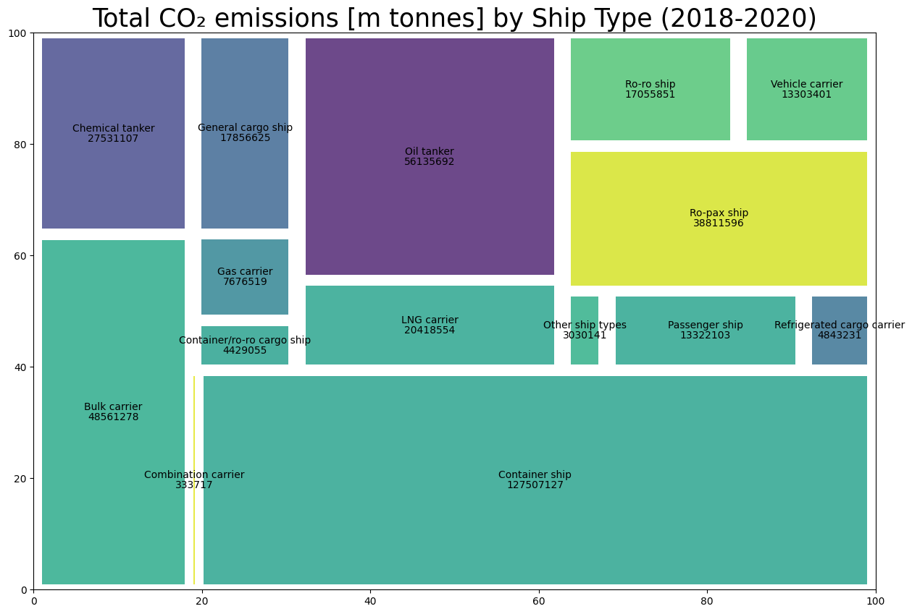
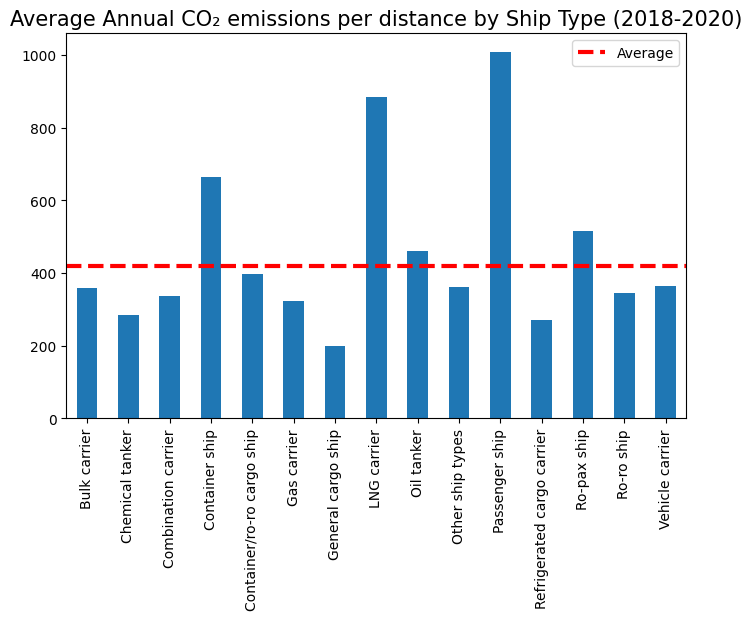
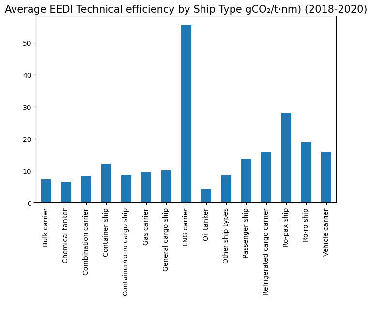
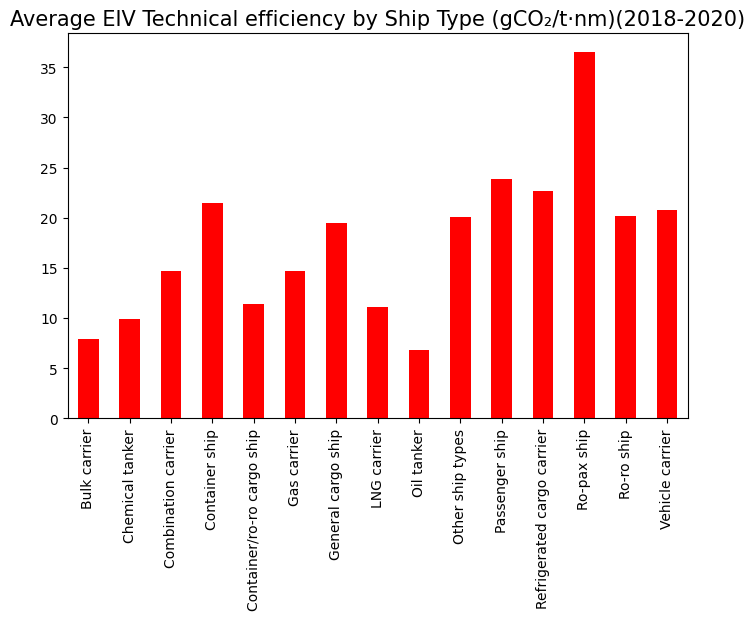
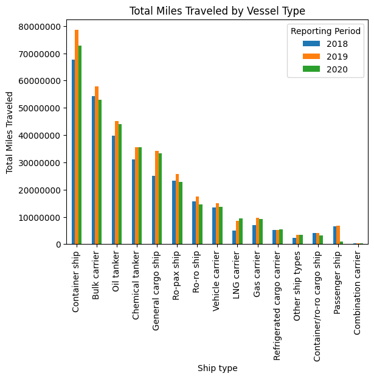

## Overview: Analyzing THETIS-MRV CO2 Emission Data

by: Robert Harrow

The European Union requires ships larger than 5000 tons that dock in the EU to declare their emissions to
the MRV system, which is made available [here](https://mrv.emsa.europa.eu/#public/emission-report).

We are tasked with answering the following questions:
* How many ships of each type are there?
* How do the emissions profiles differ for the different ship types?
* What is the relationship between ship Deadweight and emissions intensity?
* How many miles did each vessel in the database travel?

## Data

Data for this analysis comes from the European Maritime Safety Agency (EMSA). In accordance to Regulation (EU) 2015/757, ships larger than 5000 tons that dock in the EU are required to declare their emissions to
EMSA's MRV system.

The data is released annually and can be downloaded from the EMSA website. The data for this analysis was downloaded for the years 2018, 2019 and 2020. Each year comes as a .xlsx file.

## Results

### How many different ships are there of each type?

#### Ship counts by type
* Passenger ship: 205
* Other ship types: 195
* Ro-pax ship: 421
* Ro-ro ship: 311
* Bulk carrier: 5349
* General cargo ship: 1494
* Chemical tanker: 1774
* Container ship: 2281
* Refrigerated cargo carrier: 191
* Vehicle carrier: 549
* Container/ro-ro cargo ship: 88
* Gas carrier: 475
* Oil tanker: 2630
* Combination carrier: 18
* LNG carrier: 317

**TOTAL:** 16,538

### Emission profiles

#### Total Co2 Emissions by Ship Type

#### Annual average CO₂ emissions per distance travelled

#### Technical Efficiency for Ships Using EEDI Measures

#### Technical Efficiency for Ships Using EIV Measures

### How many miles did each vessel in the database travel?

Again, like some of the questions above this one has a bit of ambiguity built in.
* Does it mean how many miles each vessel traveled each year? Or in total for all years in this analysis?
* We assume 'miles' here refers to nautical miles

It's also impossible given the dataset to assume all distance metrics reported are comparable.
"MRV Regulation offers two alternatives, distance traveled may either be the distance of the most direct route between the ports of departure and arrival, or the actual distance traveled, expressed in nautical miles" - [ics-shipping.org](https://www.ics-shipping.org/wp-content/uploads/2020/08/ics-guidance-on-eu-mrv.pdf).

For simplicity, however, we'll assume all distance metrics are comparable.
Second, there is a question of how this data is to be presented. There are 16,538 unique vessels in this dataset. In the notebook, we will provide a quick visual representation of how this data is distributed.

## Repository Structure

'''
├── analysis.ipynb
├── data
├── images

'''